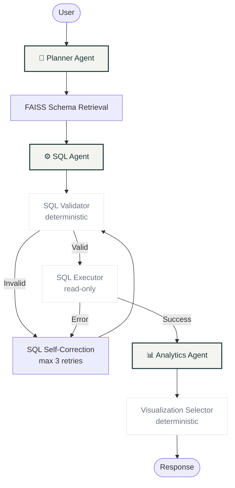

# ✨ DataLens (Agentic SQL Intelligence Platform)

A production-quality full-stack application that transforms any relational database into an interactive conversational agent. Powered by **3 specialized AI agents** orchestrated via **LangGraph**, it enables users to query data in natural language, retrieve insights, and visualize results instantly—with zero setup required.


## 🏗 Architecture & Workflow

DataLens follows a strictly orchestrated LangGraph state machine, ensuring high security and deterministic execution.



## 🛠 Tech Stack

| Layer | Technology |
|-------|-----------|
| **Backend API** | Python 3.12+, FastAPI, SQLAlchemy, Pydantic |
| **Agent Orchestration** | LangGraph, LangChain Core |
| **LLM Inference** | HuggingFace Embeddings, Ollama (local) or Gemini API |
| **Database** | SQLite (demo provided), PostgreSQL, MySQL |
| **Vector Store** | FAISS CPU (`>=1.12.0`), `sentence-transformers` |
| **Frontend UI** | React 18, Vite, Recharts, Custom Light Theme (Fraunces + Inter) |

## 🚀 Quick Start

### 1. Backend Setup

```bash
cd backend

# Install dependencies
pip install -r requirements.txt

# Configure environment
cp .env.example .env

# Generate the sample database (25k orders, 7 tables)
python generate_sample_db.py

# Start the API server
python -m uvicorn app.main:app --reload --port 8000
```

### 2. Frontend Setup

```bash
cd frontend

# Install packages
npm install

# Start Vite Dev Server
npm run dev
# → Open http://localhost:5173
```

### 3. LLM Setup (Ollama)

Ensure Ollama is running locally and pull the Qwen model (or set `.env` to use Gemini):
```bash
ollama pull qwen3:8b
```

## 🛡️ Enterprise-Grade Security Guarantees

Unlike simple Text-to-SQL wrappers, DataLens implements strict guardrails:
1. **Deterministic SQL Validation:** `DROP`, `DELETE`, `UPDATE`, `INSERT`, `ALTER`, `CREATE` are explicitly blocked via regex/AST before reaching the database.
2. **Read-Only Rollbacks:** Every query execution wraps in a transaction that is immediately rolled back (`session.rollback()`).
3. **Smart Retries:** When a query fails, the SQL agent is fed the raw SQLite/Postgres error message to self-correct up to 3 times.

## 📁 Repository Structure

- `backend/app/agents/` — Definitions for Planner, SQL, and Analytics LangChain agents.
- `backend/app/graph/` — The LangGraph state machine definitions and node handlers.
- `backend/app/tools/` — Deterministic Python tools for validation, execution, and charting.
- `backend/app/retrieval/` — FAISS vector store logic for embedding large database schemas.
- `frontend/src/App.css` — Global design system implementing the DataLens styling.
- `frontend/src/components/` — React views for Chat, Schema Explorer, Query History, and Metrics.

---
See `AGENTS.md` for a deep dive into the specific agent architectures and responsibilities.
See `PROGRESS.md` for a full changelog of the development process.
